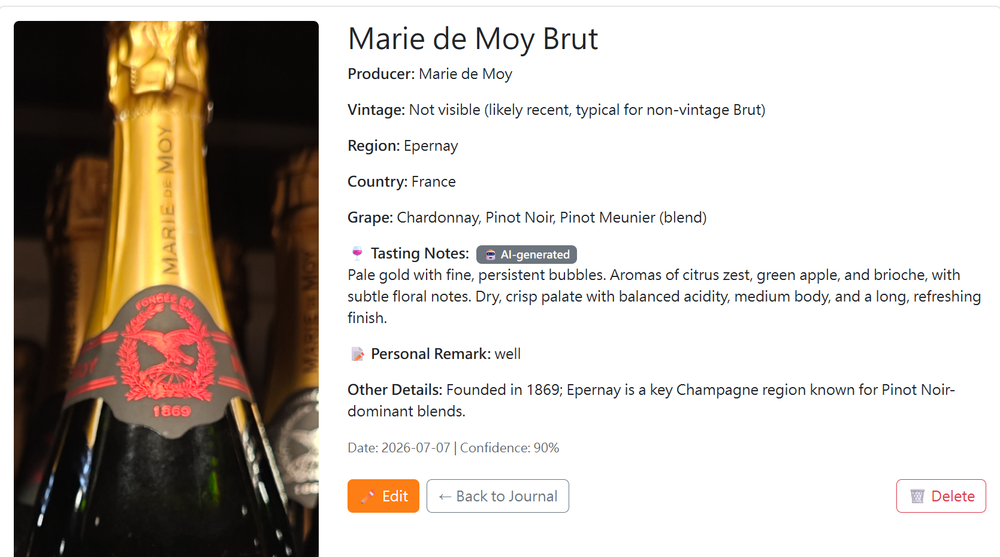
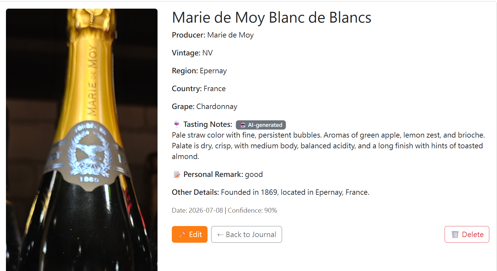
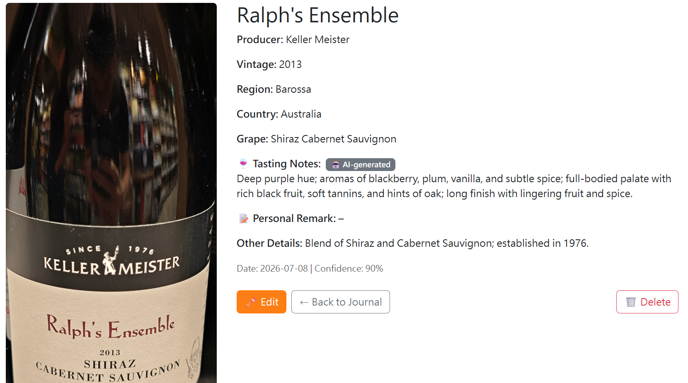
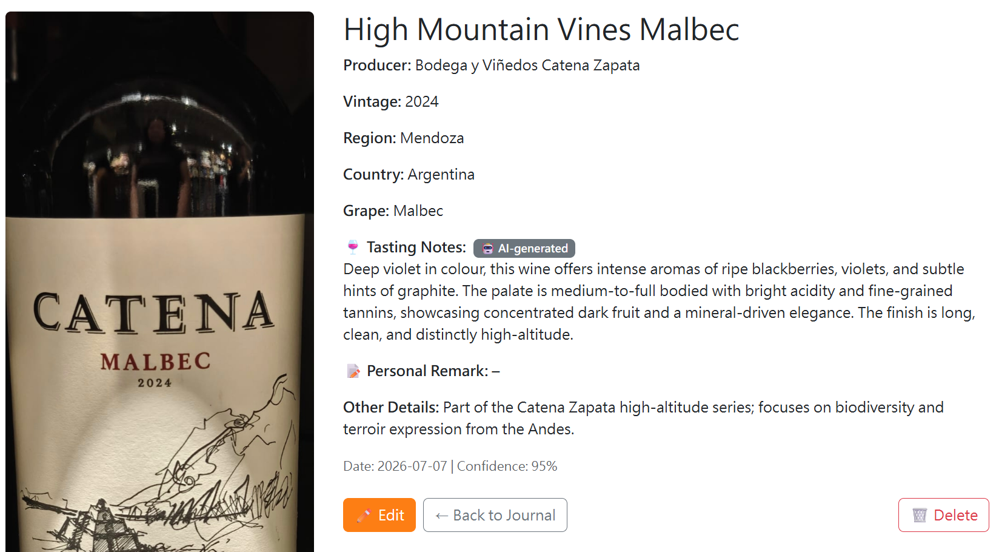
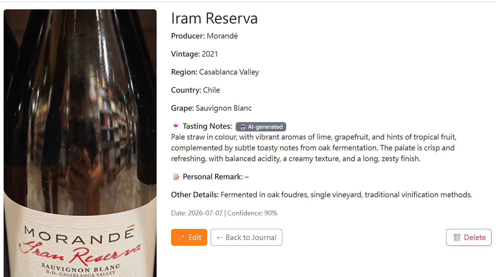
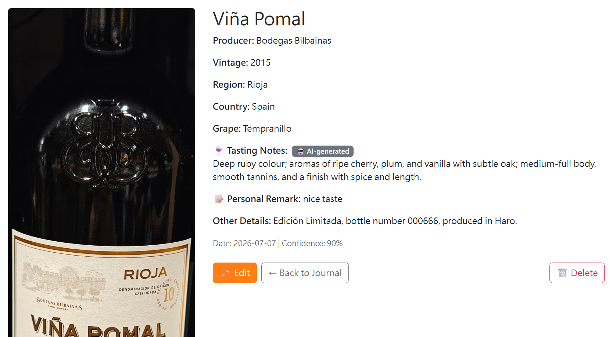
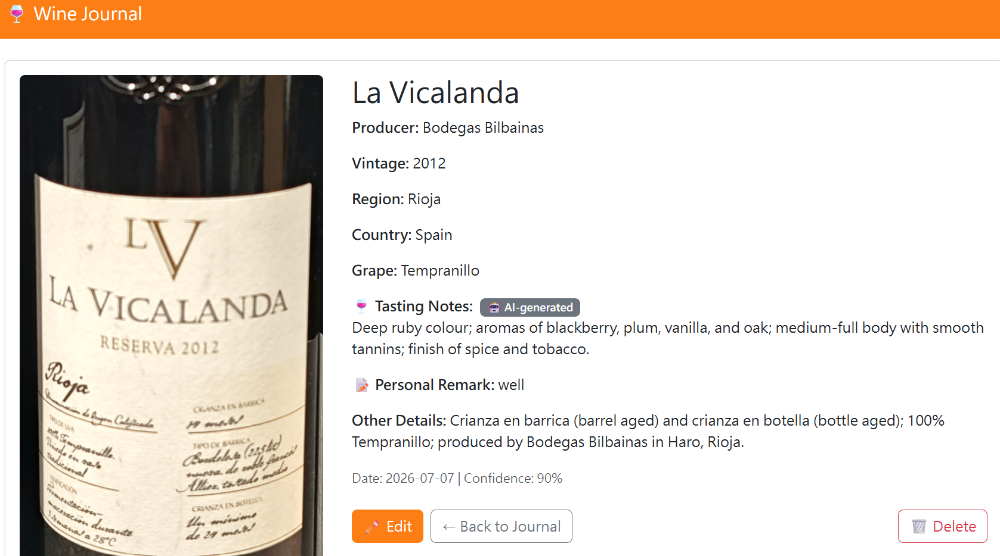
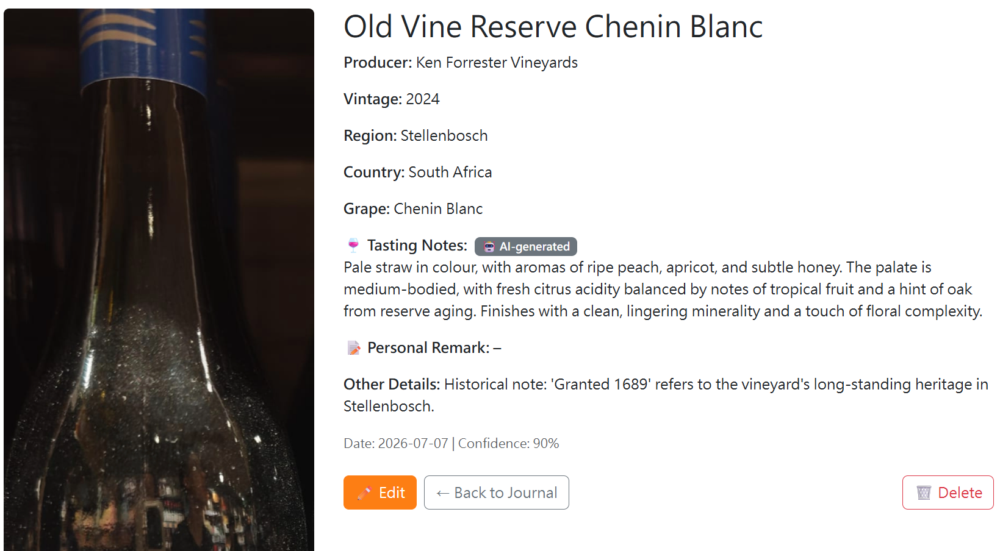

# 🍷 Wine Journal – AI-Powered Label Recognition

A lightweight Flask web app that lets you snap a photo of a wine label, automatically extract structured wine information using a powerful cloud vision AI, and build a personal wine journal with AI-generated tasting notes.

---

## How to Run the Demo

### 1. Clone the repository & set up a virtual environment

```bash
git clone https://github.com/your-username/wine-journal.git
cd wine-journal
python -m venv venv

# Activate the virtual environment
# macOS / Linux:
source venv/bin/activate
# Windows:
venv\Scripts\activate
```

### 2. Install dependencies**

```bash
pip install -r requirements.txt
```

### 3. Get an OpenRouter API key**

- Sign up at [openrouter.ai](https://openrouter.ai/)
- Go to [openrouter.ai/keys](https://openrouter.ai/keys) and create a new API key.
- Copy the key.

### 4. Configure environment variables**

Create a `.env` file in the project root and add:

```text
OPENROUTER_API_KEY=sk-or-v1-xxxxxxxxxxxxxxxxxxxxxxxxxxxxxxxx
```
### 5. (Optional) If upgrading from an older version that lacked tasting notes**

If you already have an existing instance/journal.db database, run the migration script to add the tasting_notes column:

```bash
python add_column.py                  # adds tasting_notes (if missing)
python add_personal_remark_column.py  # adds personal_remark (if missing)
```

_For fresh installations this step is not needed - the database is created automatically with all required columns._

### 6. Start the Flask app**

```bash
python app.py
```

The app will be available at <http://127.0.0.1:5000>.

**What AI / Model / API I Used**

- **Cloud Vision Model:** **GLM‑4.6V** (from Zhipu AI / [z.ai](https://z.ai/)) via **OpenRouter** - a unified API gateway that provides OpenAI‑compatible endpoints.
- **Why this model:** GLM‑4.6V is a state‑of‑the‑art open‑source vision‑language model with excellent image understanding and textual knowledge. It excels at reading text from images (like wine labels) and can infer missing details (region, grape variety, tasting notes) from its training data.

_Previously, the prototype used Tesseract OCR + a local Llama 3.2 3B text model (via Ollama) to extract and structure label information. However, the local GPU (NVIDIA MX550, 2GB VRAM) could not run stronger vision models efficiently, making the recognition slow and less accurate. The cloud API approach solves this - it's fast, accurate, and requires no heavy local hardware._

**Recognition Approach**

- **1. Image Upload** - The user captures or uploads a photo of a wine label.
- **2. Direct Vision Analysis** - The image is sent (as base64) to GLM‑4.6V through OpenRouter.
- **3. Structured Extraction** - The model is prompted to extract:
  - Wine name
  - Producer / winery
  - Vintage
  - Region & country
  - Grape variety
  - **AI‑generated tasting notes** (colour, aromas, palate, finish)
  - Confidence score
- **4. Confidence & Fallback** - The model self‑rates its confidence (0-1). Low‑confidence entries show a warning on the edit page, and the user can manually correct any field.
- **5. Journal Entry Creation** - A new dated entry is saved to the SQLite database, and the user is redirected to an edit form to review or adjust the results.
- **6. User Correction** - All fields (including tasting notes) are editable.The user can also add a personal remark to capture their own thoughts or memories about the wine and their changes are saved permanently.

**What Works Well**

- **End‑to‑end flow** - from photo to saved journal entry in a clear workflow.
- **Confidence transparency** - high‑confidence results are clearly indicated; low‑confidence results are flagged for review.
- **AI‑generated tasting notes** - the model suggests a professional tasting note based on the recognised wine, clearly labelled as "AI‑generated".
- **Personal remarks** - a separate text field lets users write their own notes, memories, or ratings.
- **Advanced filtering** – the journal list can be filtered by wine name, producer, vintage, region, country, grape variety, tasting notes, other details, and personal remark.
- **Persistent filters** – after applying a search or filter, clicking into an entry and then using the “Back to Journal” button returns you to the same filtered list, not the full journal, so you never lose your place.
- **Persistent bulk delete** – when entering bulk‑delete mode, selected checkboxes survive navigation to other pages (e.g., viewing, editing or delete an entry) until explicitly cancelled, making multi‑entry deletion effortless.
- **Loading feedback** - an overlay appears during recognition (“Recognizing your wine…”) so users know the app is working.
- **Clean user interface** - orange‑themed, mobile‑responsive design with hover effects on the journal list, search, advanced filters, and bulk delete.
- **Graceful fallback** - if blurry, angled labels are received, the entry is still created with raw error details and the potential correct information, and then user can fill or correct the fields manually if necessary. The user can know whether that fields are filled with confidence or not based on the occurance of error detils.

## Demo Example
Here is a real wine label photo and the resulting journal entry generated by the AI.

<table style="width:100%; table-layout:fixed; border-collapse:collapse;">
  <tr>
    <th style="width:50%;"><strong>Input (Wine Label Photo)</strong></th>
    <th style="width:50%;"><strong>Output (Generated Journal Entry)</strong></th>
  </tr>
  <!-- Example 1 -->
  <tr>
    <td></td>
    <td></td>
  </tr>
  <!-- Example 2 -->
  <tr>
    <td></td>
    <td></td>
  </tr>
  <!-- Example 3 -->
  <tr>
    <td></td>
    <td></td>
  </tr>
  <!-- Example 4 -->
  <tr>
    <td></td>
    <td></td>
  </tr>
  <!-- Example 5 -->
  <tr>
    <td></td>
    <td></td>
  </tr>
  <!-- Example 6 -->
  <tr>
    <td></td>
    <td></td>
  </tr>
  <!-- Example 7 -->
  <tr>
    <td></td>
    <td></td>
  </tr>
  <!-- Example 8 -->
  <tr>
    <td></td>
    <td></td>
  </tr>
</table>

**Known Limitations**

- **Requires internet** - the app depends on the OpenRouter API; no offline mode is currently implemented.
- **API cost / rate limits** -  each recognition require token usage and rate limits by the openRouter response speed which may leds to longer recognization time.
- **Tasting notes quality** - they are generated by the AI based on typical profiles; they don't come from an actual tasting of the bottle review from the internet
- **No wine database verification** - the model relies on its training data; sometimes vi.ntages or rare producers may be guessed incorrectly.


**What I Would Improve with More Time**

- **Offline fallback** - reintegrate a lightweight local vision model (e.g., LLaVA‑Phi3) as a backup when the API is unavailable.
- **response rate** - enable streaming and chosing faster, stabler provider or choosing advanced models that compute and response faster or setting max_tokens to smaller value that gets me correct information.
- **better UX** - aallow users to compare two wine entries side‑by‑side or easily navigate between filtered views.
- **Integrate search API with GLM4.6V** - enhance tasting note quality by fetching real wine reviews from the web.
- **Better error handling** - detect if very unclear label or image is uploaded, prompt the user to retake the photo.
- **Wine database matching** - cross‑reference recognised fields with a public wine database (e.g., [Wine.com](https://wine.com/), Vivino) to boost accuracy.
- **User accounts & sync** - multi‑device support and cloud backup of the journal.
- **Mobile app** - package as a PWA or native mobile app for a smoother camera‑first experience.